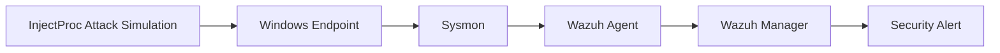

# 🛡️ Detecting Process Injection Attacks with Wazuh & Sysmon

<p align="center">


</p>

---

## 📖 Overview

This project demonstrates how to build a Security Operations Center (SOC) detection lab capable of identifying **Process Injection Attacks** using **Wazuh SIEM** and **Microsoft Sysmon**.

Process Injection is a common **Defense Evasion** technique where malicious code is injected into legitimate Windows processes to evade detection. To safely emulate this behavior without using malware, this lab leverages **InjectProc**, an open-source process injection simulation tool.

The objective is to generate process injection telemetry on a Windows endpoint, collect it through Sysmon, forward it to Wazuh, and create custom detection rules that generate high-fidelity alerts while reducing false positives.

---

## 🎯 Project Objectives

### 🔥 Attack Simulation

Emulate common process injection techniques using **InjectProc** on a Windows endpoint.

### 📡 Telemetry Collection

Configure **Sysmon** to capture low-level Windows events, including:

* Event ID 8 – CreateRemoteThread
* Process Creation Events
* DLL Load Events

### 🚨 SIEM Detection

Develop custom **Wazuh rules** that:

* Detect suspicious injection activity
* Map detections to MITRE ATT&CK
* Suppress common false positives
* Generate analyst-friendly alerts

---

## 🏗️ Lab Architecture



---

# ⚙️ Lab Setup

The following components were used to build the detection lab.

---

## 💻 Windows Endpoint

### Operating System

* Windows 10 / 11 (64-bit)

### Required Runtime

* Microsoft Visual C++ Redistributable (x64)
[Visual C++ Installed](https://www.microsoft.com/en-us/download/details.aspx?id=53840)


---

## 🧪 Attack Simulation Tools

### InjectProc

InjectProc is used to emulate process injection techniques without deploying malware.

#### Installation Steps

1. Download [**InjectProc.exe**](https://github.com/secrary/InjectProc/releases)
2. Navigate to the **Assets** section of the release page
3. Download the executable
4. If Microsoft Defender blocks the file:

   * Click **(...)**
   * Click **Keep**
   * Click **Delete Drop Down**
   * Select **Keep Anyway**


---

### Test DLL

A benign DLL is used as the injection payload.

**File:** `hello-world-x64.dll`

Download the DLL from the Assets section of the release page.

[DLL Download](https://github.com/carterjones/hello-world-dll/releases)


---

## 🧰 Additional Software

The following applications were installed to provide legitimate target processes during testing:

* [Google Chrome](https://www.google.com/intl/en_uk/chrome/)
* [WinRAR](https://www.win-rar.com/download.html?&L=0)


---

## 🛡️ Wazuh Infrastructure

### Wazuh Manager

A dedicated [Wazuh server](https://github.com/malwarekid/SOAR-Flow) was deployed to collect and analyze endpoint telemetry.


---

### Wazuh Agent

A [Wazuh agent](https://documentation.wazuh.com/current/installation-guide/wazuh-agent/index.html) was installed on the Windows endpoint to forward Sysmon events.


---

## 🔍 Sysmon Deployment

Sysmon was installed to provide enhanced Windows telemetry.

### Download Components

* [Sysmon64.exe](https://learn.microsoft.com/en-us/sysinternals/downloads/sysmon)
* [sysmonconfig.xml](sysmonconfig.xml)


### install sysmon

Install Sysmon using an elevated PowerShell(Run as administrator) session:

Go to Sysmon directory an run this command.

```powershell
.\sysmon64.exe -accepteula -i .\sysmonconfig.xml
```


---


# ⚙️ Wazuh Agent Configuration

After configuring Sysmon, the next step is to enable Sysmon log collection through the Wazuh Agent and create a custom detection rule on the Wazuh Manager.

---

## 📡 Configure Wazuh Agent to Collect Sysmon Logs

Navigate to the Wazuh Agent installation directory and open the configuration file:

```text
C:\Program Files (x86)\ossec-agent\ossec.conf
```

Add the following configuration inside the `<ossec_config>` section:

```xml
<localfile>
    <location>Microsoft-Windows-Sysmon/Operational</location>
    <log_format>eventchannel</log_format>
</localfile>
```
**`ctrl + s`to save file**
### What does this configuration do?

* Collects Sysmon Operational logs
* Forwards Windows Event Channel data to Wazuh
* Enables visibility into process injection telemetry

### Configuration Example


---

## 🔄 Restart the Wazuh Agent

After saving the configuration, restart the Wazuh Agent to apply the changes.

### Using PowerShell (Administrator)

```powershell
Restart-Service -Name wazuh
```

### Alternative Method

1. Open **Computer Management**
2. Navigate to **Services**
3. Locate **Wazuh Agent**
4. Click **Restart**


   
### or manager apps to restart
1. windows star to search **manage**
2. Open **Wazuh Manager**
3. Locate **manage**
4. Click **Restart**


---

# Technique 1: DLL Injection (MITRE ATT&CK T1055.001)

## 🚨 Wazuh Custom Detection Rule for DLL Injection

To detect Process Injection activity using Sysmon and Wazuh, create a custom detection rule on the Wazuh Manager.
---
### Step 1: Create a Custom Rule

Open the local rules file:

```bash
sudo nano /var/ossec/etc/rules/local_rules.xml
```

Add the following rules:

```xml
<group name="windows,sysmon">
  <rule id="100200" level="12">
    <if_sid>61610</if_sid>
    <description>Possible process injection activity detected from "$(win.eventdata.sourceImage)" on "$(win.eventdata.targetImage)"</description>
    <mitre>
      <id>T1055.001</id>
    </mitre>
  </rule>

  <rule id="100100" level="0">
    <if_sid>100200</if_sid>
    <field name="win.eventdata.sourceImage" type="pcre2">(C:\\\\Windows\\\\system32)|chrome.exe</field>
    <description>Ignore Windows binaries and Chrome</description>
  </rule>
</group>
```

### 💾 Save & Apply Configuration

After adding the rules:

  * Press **Ctrl + O** → Save
  * Press **Enter** → Confirm
  * Press **Ctrl + X** → Exit
 

---
### Step 2: Restart the Wazuh Manager

Apply the changes by restarting the Wazuh Manager:

```bash
sudo systemctl restart wazuh-manager
```

---

## 🧪 Simulating DLL Injection

1. Open **Command Prompt**
2. Open **PowerShell as Administrator**.
3. Navigate to the directory containing `InjectProc.exe` and `hello-world-x64.dll`, then execute:

```powershell
.\InjectProc.exe dll_inj hello-world-x64.dll cmd.exe
```

### DLL Injection Execution


---

## 🔍 Initial Observation

After executing the DLL injection, the Windows Event Viewer generated **Event ID 1** instead of the expected **Event ID 8**.

### Windows Event Log


### Wazuh Alert


At this stage, Sysmon was only generating **Process Creation (Event ID 1)** logs, while the DLL injection activity was expected to trigger **CreateRemoteThread (Event ID 8)**.

---

## ⚙️ Updating Sysmon Configuration

To capture DLL Injection activity, add the following configuration to the **CreateRemoteThread** section of `sysmonconfig.xml`:

Open notpad(Run as Administrator) file to open `sysmonconfig.xml` file.

`Ctrl + F` to search `<CreateRemoteThread`

```xml
<CreateRemoteThread onmatch="include">
  <SourceImage condition="contains">InjectProc.exe</SourceImage>
</CreateRemoteThread>
```
**`ctrl + s`to save file**


Apply the updated Sysmon configuration:

```powershell
cd C:\Sysmon
.\Sysmon64.exe -c .\sysmonconfig.xml
```

---

# 🎯 Result

The custom Sysmon configuration successfully captured the DLL Injection activity through **Event ID 8 (CreateRemoteThread)**. Wazuh then processed the Sysmon event and generated an alert mapped to **MITRE ATT&CK T1055.001 – DLL Injection**.


## ✅ Verification After Configuration Update

After updating and reloading the Sysmon configuration, the DLL injection activity successfully generated **Event ID 8 (CreateRemoteThread)** logs.

### Windows Event Log – Event ID 8


### Wazuh Detection


---


# Technique 2: Process Hollowing / DLL Injection Variant (MITRE ATT&CK T1055.012)

## 🚨 Wazuh Custom Detection Rule

To detect process injection activity, create a custom rule on the Wazuh Manager.

---

### Step 1: Open Local Rules File

```bash id="r1"
sudo nano /var/ossec/etc/rules/local_rules.xml
```

---

### Step 2: Add Custom Detection Rule

```
<group name="windows,sysmon">
  <rule id="100201" level="12">
    <if_sid>61600</if_sid>
    <description>Process injection activity detected: "$(win.eventdata.Image)" has been tampered with</description>
    <mitre>
      <id>T1055.012</id>
    </mitre>
  </rule>
</group>
```

### 💾 Save & Apply Configuration

After adding the rules:

  * Press **Ctrl + O** → Save
  * Press **Enter** → Confirm
  * Press **Ctrl + X** → Exit

---

### Step 3: Restart Wazuh Manager

```bash id="r3"

sudo systemctl restart wazuh-manager
```

---

## 🧪 Simulating Process Injection (proc_replace)

Open **PowerShell (Administrator)** and navigate to the directory containing `InjectProc.exe`.

Run the following command:

```powershell id="r4"
.\InjectProc.exe proc_rpl "C:\Program Files\Google\Chrome\Application\chrome.exe" "C:\Program Files\WinRAR\WinRAR.exe"
```


---

# 🎯 Result

The custom Wazuh rule successfully detects process injection behavior (T1055.012) by monitoring suspicious process image tampering events generated via Sysmon telemetry.

## 🔍 Detection Output

After execution, Wazuh detected suspicious process behavior based on Sysmon logs and generated an alert mapped to MITRE ATT&CK technique.

### Wazuh Alert Dashboard


---


