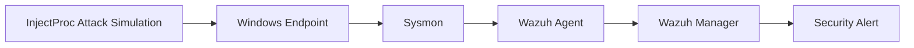

# 🛡️ Detecting Process Injection Attacks with Wazuh & Sysmon

<p align="center">


</p>

---

## 📖 Overview

This project demonstrates how to build a Security Operations Center (SOC) detection lab capable of identifying **Process Injection Attacks** using **Wazuh SIEM** and **Microsoft Sysmon**.

Process Injection is a common **Defense Evasion** technique where malicious code is injected into legitimate Windows processes to evade detection. To safely emulate this behavior without using malware, this lab leverages **InjectProc**, an open-source process injection simulation tool.

The objective is to generate process injection telemetry on a Windows endpoint, collect it through Sysmon, forward it to Wazuh, and create custom detection rules that generate high-fidelity alerts while reducing false positives.

---

## 🎯 Project Objectives

### 🔥 Attack Simulation

Emulate common process injection techniques using **InjectProc** on a Windows endpoint.

### 📡 Telemetry Collection

Configure **Sysmon** to capture low-level Windows events, including:

* Event ID 8 – CreateRemoteThread
* Process Creation Events
* DLL Load Events

### 🚨 SIEM Detection

Develop custom **Wazuh rules** that:

* Detect suspicious injection activity
* Map detections to MITRE ATT&CK
* Suppress common false positives
* Generate analyst-friendly alerts

---

## 🏗️ Lab Architecture



---

# ⚙️ Lab Setup

The following components were used to build the detection lab.

---

## 💻 Windows Endpoint

### Operating System

* Windows 10 / 11 (64-bit)

### Required Runtime

* Microsoft Visual C++ Redistributable (x64)
[Visual C++ Installed](https://www.microsoft.com/en-us/download/details.aspx?id=53840)


---

## 🧪 Attack Simulation Tools

### InjectProc

InjectProc is used to emulate process injection techniques without deploying malware.

#### Installation Steps

1. Download [**InjectProc.exe**](https://github.com/secrary/InjectProc/releases)
2. Navigate to the **Assets** section of the release page
3. Download the executable
4. If Microsoft Defender blocks the file:

   * Click **(...)**
   * Click **Keep**
   * Click **Delete Drop Down**
   * Select **Keep Anyway**


---

### Test DLL

A benign DLL is used as the injection payload.

**File:** `hello-world-x64.dll`

Download the DLL from the Assets section of the release page.

[DLL Download](https://github.com/carterjones/hello-world-dll/releases)


---

## 🧰 Additional Software

The following applications were installed to provide legitimate target processes during testing:

* [Google Chrome](https://www.google.com/intl/en_uk/chrome/)
* [WinRAR](https://www.win-rar.com/download.html?&L=0)


---

## 🛡️ Wazuh Infrastructure

### Wazuh Manager

A dedicated [Wazuh server](https://github.com/malwarekid/SOAR-Flow) was deployed to collect and analyze endpoint telemetry.


---

### Wazuh Agent

A [Wazuh agent](https://documentation.wazuh.com/current/installation-guide/wazuh-agent/index.html) was installed on the Windows endpoint to forward Sysmon events.


---

## 🔍 Sysmon Deployment

Sysmon was installed to provide enhanced Windows telemetry.

### Download Components

* [Sysmon64.exe](https://learn.microsoft.com/en-us/sysinternals/downloads/sysmon)
* [sysmonconfig.xml](sysmonconfig.xml)


### install sysmon

Install Sysmon using an elevated PowerShell(Run as administrator) session:

Go to Sysmon folder an run this command.

```powershell
.\sysmon64.exe -accepteula -i .\sysmonconfig.xml
```


---

## ✅ Environment Summary

| Component       | Purpose              |
| --------------- | -------------------- |
| Windows 10/11   | Test Endpoint        |
| Sysmon          | Telemetry Collection |
| Wazuh Agent     | Log Forwarding       |
| Wazuh Manager   | SIEM Platform        |
| InjectProc      | Attack Emulation     |
| Hello World DLL | Injection Payload    |
| Chrome / WinRAR | Target Processes     |


## 📝 Description

This project demonstrates how to set up a Security Operations Center (SOC) lab to detect **Process Injection Attacks** using **Wazuh (SIEM)** and Windows **Sysmon**. 

Process injection is a defense evasion technique where an attacker hides malicious code inside a legitimate Windows process. To safely simulate this behavior without using actual malware, this project utilizes **InjectProc**—an open-source emulation tool. Since InjectProc interacts with low-level Windows APIs and doesn't support all Windows versions, a specific compatible lab environment was engineered to capture the attack lifecycle.

**Attack Simulation: Emulating two common process injection techniques using InjectProc on a Windows endpoint.

**Telemetry Collection: Configuring Sysmon to capture kernel-level events (like Event ID 8: CreateRemoteThread).

**SIEM Detection: Writing custom Wazuh rules to trigger high-fidelity alerts and filter out false positives from legitimate applications like Google Chrome.
so we set up our lab environment using the following:

## Lab Setup

Windows 10/11 64-bit, Microsoft Visual C++ installed ([vc_redist.x64.exe](https://www.microsoft.com/en-us/download/details.aspx?id=53840)).


[InjectProc](https://github.com/secrary/InjectProc/releases) downloaded and installed on the Windows endpoint.

go GitHub repository> Assets> InjectProc.exe

click block file (...) than keep> Delete  to select "keep anyway". 


[hello-world-x64.dll](https://github.com/carterjones/hello-world-dll/releases) downloaded on the Windows endpoint.


go GitHub repository> Assets> hello-world-x64.dll


[Google Chrome](https://www.google.com/intl/en_uk/chrome/) and [WinRAR](https://www.win-rar.com/download.html?&L=0) installed on the Windows endpoint.

An installed [Wazuh server](https://github.com/malwarekid/SOAR-Flow) running version.


An installed Wazuh agent on the Windows endpoint


[Sysmon](https://learn.microsoft.com/en-us/sysinternals/downloads/sysmon) installed on the Windows endpoint.

an download the Sysmon configuration file: [sysmonconfig.xml](sysmonconfig.xml).


using PowerShell (Run as administrator) and go sysmon folder run this command 
```PowerShell
.\sysmon64.exe -accepteula -i .\sysmonconfig.xml
```


Wazuh agent mechin to open this file "ossec.conf", C:\Program Files (x86)\ossec-agent and edit to collect sysmon logs
this Rules add tha currect place.
```Rules
<localfile>
    <location>Microsoft-Windows-Sysmon/Operational</location>
    <log_format>eventchannel</log_format>
</localfile>
```


Restart the Wazuh agent using PowerShell (Run as administrator) 
```PowerShell
Restart-Service -Name wazuh
```

or manager apps to restart
windows star to search "manage" open tha apps than manage to restart


Wazuh server mechin to open this file "local_rules.xml",
```bash
sudo nano /var/ossec/etc/rules/local_rules.xml
```

an add this Rules
```` Rules
<group name="windows,sysmon">
  <rule id="100200" level="12">
    <if_sid>61610</if_sid>
    <description>Possible process injection activity detected from "$(win.eventdata.sourceImage)" on "$(win.eventdata.targetImage)"</description>
    <mitre>
      <id>T1055.001</id>
    </mitre>
  </rule>
 
  <rule id="100100" level="0">
    <if_sid>100200</if_sid>
    <field name="win.eventdata.sourceImage" type="pcre2">(C:\\\\Windows\\\\system32)|chrome.exe</field>
    <description>Ignore Windows binaries and Chrome</description>
  </rule>
</group>
````


